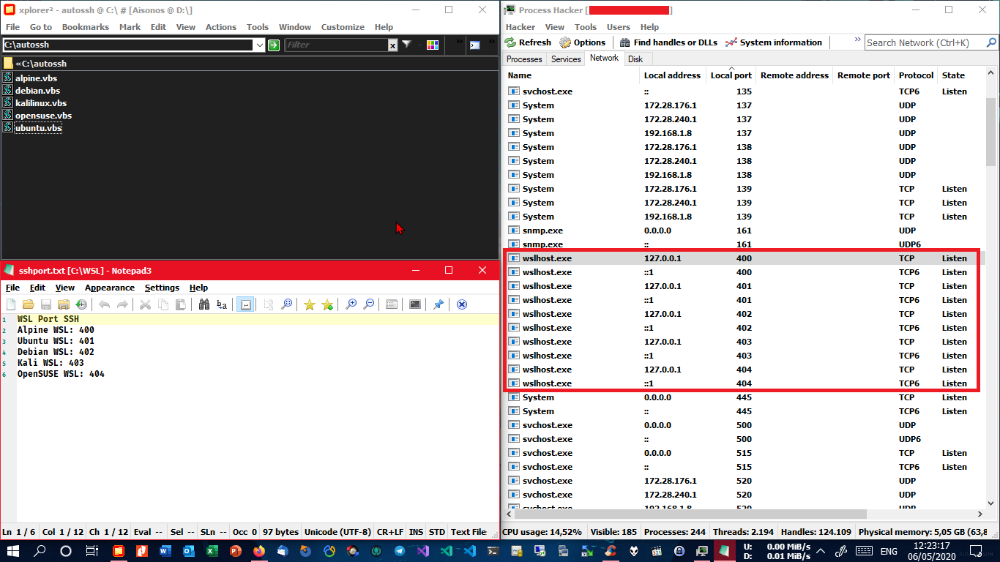
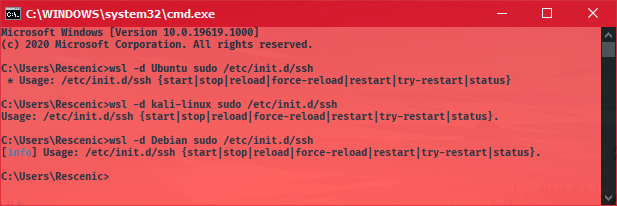
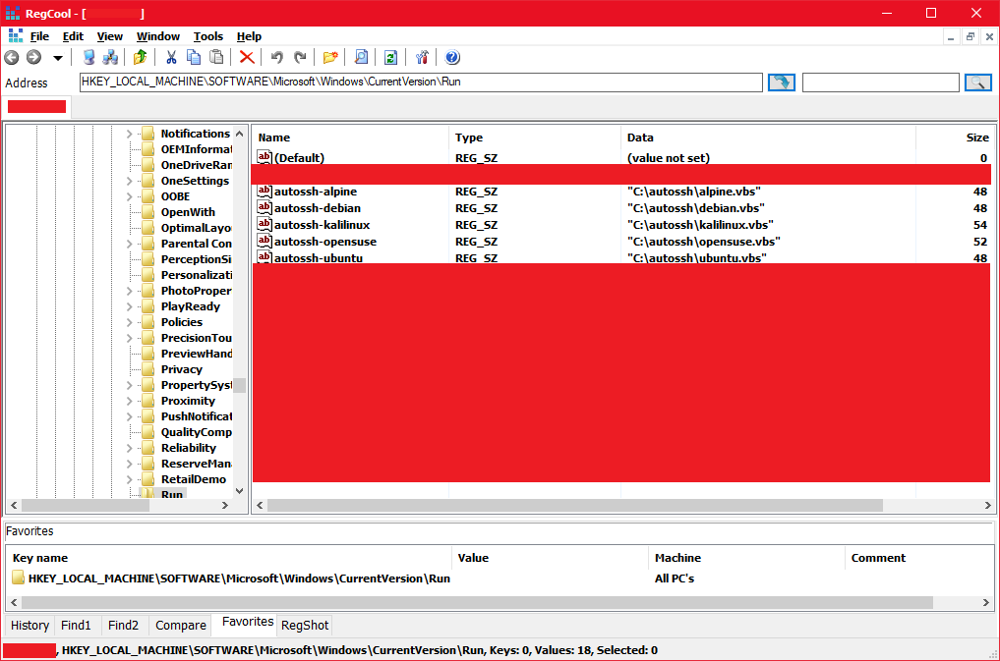

# AutoSSH
Support for starting SSH services in Windows Subsystem for Linux (WSL) on Windows 10 startup. <br/>
For example, I set SSH port number for `Alpine WSL 400`, `Ubuntu WSL 401`, `Debian WSL 402`, `Kali Linux WSL 403`, and `openSUSE Leap WSL 404`.<br/>


## Table of Contents

* [Installation](#installation)
* [License](#license)

## Installation

* Clone to any directory using the git command: (e.g `C:\autossh`)
``` shell
git clone https://github.com/rescenic/autossh.git
```
* Step 1: Setup OpenSSH Server without password and change SSH port of each Linux WSL in the system.
```update wsl
* Update Linux WSL
sudo apk update && sudo apk upgrade (for Alpine WSL)
sudo apt-get update && sudo apt-get upgrade (for Ubuntu WSL)
sudo apt update && sudo apt upgrade (for Debian, Kali Linux)
sudo zypper ref && sudo zypper up (for OpenSUSE Leap WSL)
```

```install openssh-server
* Install OpenSSH Server
sudo apk add openssh-server (for Alpine WSL)
sudo apt-get install openssh-server (for Ubuntu WSL)
sudo apt install openssh-server (for Debian, Kali Linux)
sudo zypper install openssh-server (for OpenSUSE Leap WSL)
```

```setup ssh port number
* Change SSH Port Number
sudo vi /etc/ssh/sshd_config
Press i to insert text, uncomment Port, and change SSH port number.
```

```setup autorun
* Setup SSH On Startup
sudo EDITOR=vi visudo 
Press i to insert text, type or copy-paste the line below, then press ESC, type :wq to save and quit. 
-----------------------------------
add this line:
%sudo ALL=NOPASSWD: /usr/sbin/sshd (for Alpine & OpenSUSE Leap WSL)
or
%sudo ALL=NOPASSWD: /etc/init.d/ssh (for Debian, Kali Linux, Ubuntu WSL)
```

```sshkeys
* Generate SSH Keys
sudo /usr/bin/ssh-keygen -A 
```

```openssh
* Start OpenSSH server for the first time
sudo /usr/sbin/sshd (for Alpine & OpenSUSE Leap WSL)
or
sudo /etc/init.d/ssh start (for Debian, Kali Linux, Ubuntu WSL)
sudo /etc/init.d/ssh won't work, need argument. See:
```


* Step 2: Add a startup item to the registry: add string key under <br />
`HKEY_LOCAL_MACHINE\SOFTWARE\Microsoft\Windows\CurrentVersion\Run` <br />


* Step 3: Restart computer and test if the installed OpenSSH Servers work.

## License
``` license
MIT License

Copyright (c) 2020 Rescenic

Permission is hereby granted, free of charge, to any person obtaining a copy
of this software and associated documentation files (the "Software"), to deal
in the Software without restriction, including without limitation the rights
to use, copy, modify, merge, publish, distribute, sublicense, and/or sell
copies of the Software, and to permit persons to whom the Software is
furnished to do so, subject to the following conditions:

The above copyright notice and this permission notice shall be included in all
copies or substantial portions of the Software.

THE SOFTWARE IS PROVIDED "AS IS", WITHOUT WARRANTY OF ANY KIND, EXPRESS OR
IMPLIED, INCLUDING BUT NOT LIMITED TO THE WARRANTIES OF MERCHANTABILITY,
FITNESS FOR A PARTICULAR PURPOSE AND NONINFRINGEMENT. IN NO EVENT SHALL THE
AUTHORS OR COPYRIGHT HOLDERS BE LIABLE FOR ANY CLAIM, DAMAGES OR OTHER
LIABILITY, WHETHER IN AN ACTION OF CONTRACT, TORT OR OTHERWISE, ARISING FROM,
OUT OF OR IN CONNECTION WITH THE SOFTWARE OR THE USE OR OTHER DEALINGS IN THE
SOFTWARE.
```
